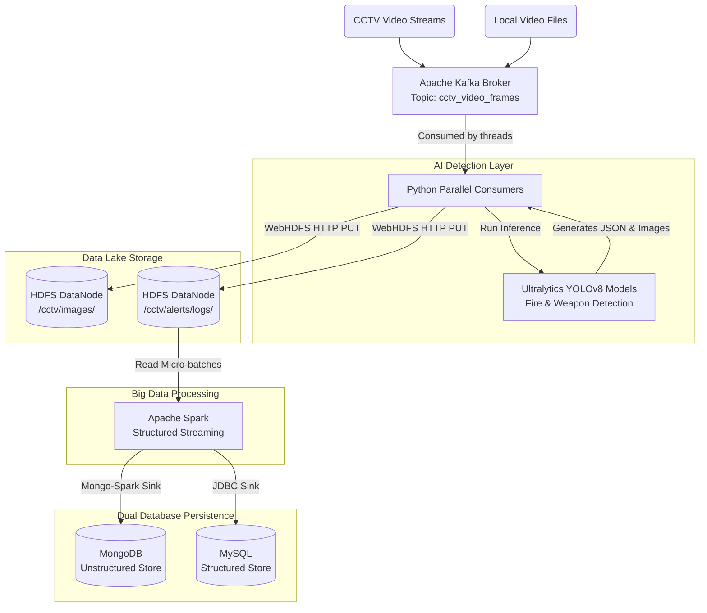

# Real-Time CCTV Threat Detection: Big Data Pipeline

This document outlines the architecture, data flow, and technologies used in the **Real-Time CCTV Fire & Weapon Detection** Big Data pipeline. The system is designed to process multiple heavy video streams in parallel, detect threats using AI, and securely store data across distributed systems with zero local file-system dependencies.

## 🏗️ Architecture Diagram

---

## 🛠️ Technology Stack & Roles

### 1. Apache Kafka (Data Ingestion)
- **Role**: Acts as the high-throughput transport layer for raw video frames.
- **Why**: Allows the system to ingest massive amounts of raw CCTV footage simultaneously without blocking the AI processors.

### 2. Python & YOLO11n (AI Processing)
- **Role**: Consumes frames from Kafka in parallel, runs them through YOLO11n computer vision models, and detects active fires and weapons.
- **Output**: Generates high-confidence JSON alert payloads and bounding-box annotated images.

### 3. Hadoop HDFS (Data Lake)
- **Role**: Serves as the central repository for unstructured AI outputs.
- **How**: The AI script bypasses the local OS entirely, piping raw image bytes and JSON metadata directly into HDFS using the `WebHDFS` REST API.
- **Optimization**: By updating Windows Docker routing, Python pushes to the DataNodes in under 2ms per frame.

### 4. Apache Spark (Stream Processing)
- **Role**: Consumes the JSON alert logs written to Hadoop in real-time using **Spark Structured Streaming**.
- **How**: Spark filters low-confidence noise, formats the schema, and manages the micro-batches.

### 5. MongoDB & MySQL (Dual Persistence)
- **Role**: Spark parallelizes the insertion of validated threat events into both databases.
- **MongoDB**: Stores the complete, flexible JSON metadata for future analytics or API querying.
- **MySQL**: Provides structured, tabular storage for fast UI dashboard generation and relational joins.

---

## 🚀 The Data Flow Lifecycle

1. **Ingestion**: Videos are read and encoded to Base64, then published to a Kafka topic.
2. **Detection**: Python worker threads pull from Kafka, decode the frames, and run AI inference.
3. **Storage**: 
   - Annotated frames are pushed directly to `hdfs://localhost:9000/cctv/images/`.
   - Threat metadata logs are pushed to `hdfs://localhost:9000/cctv/alerts/logs/`.
   - *A unique UUID prevents filename race-conditions.*
4. **Streaming**: Spark polls the HDFS `alerts/logs` directory. When a new JSON file drops, it pulls it into a DataFrame.
5. **Database Sync**: Spark streams the DataFrame output simultaneously into `cctv.threat_alerts` (MySQL) and `cctv.threat_alerts` (MongoDB).

---

## 🔧 Engineering Challenges Overcome

* **Docker to Windows Network Isolation**: Fixed Hadoop DataNode `java.net.UnknownHostException` crashes by mapping internal Docker Container IDs directly in the Windows Host file.
* **HDFS Write Overhead**: Replaced slow Subprocess Docker CLI commands with ultra-fast Python WebHDFS HTTP requests to eliminate CPU bottlenecking, reducing processing time from minutes to 15 seconds.
* **Spark Race Conditions**: Fixed HDFS `FileNotFoundException` crashes that occurred when Spark tried to read files exactly as multiple threads were overwriting them, by implementing unique Hex UUIDs.
